# Rencana Proyek — Tracker Prajurit TNI

**Pemantauan EKG + lokasi prajurit di wilayah tanpa BTS, lewat mesh LoRa dan satelit Iridium.**

Dokumen ini menjelaskan seluruh rencana dari **percobaan murah lebih dulu**, baru kemudian **pembuatan penuh**. Urutan itu disengaja dan merupakan keputusan paling penting di seluruh proyek.

Terakhir diperbarui: 24 Agustus 2026

---

## Daftar Isi

1. [Ringkasan Eksekutif](#1-ringkasan-eksekutif)
2. [Masalah & Angka yang Membuat Desain Ini Bekerja](#2-masalah--angka-yang-membuat-desain-ini-bekerja)
3. [Arsitektur Sistem](#3-arsitektur-sistem)
4. [Penempatan di Tubuh Prajurit](#4-penempatan-di-tubuh-prajurit)
5. [Peta Fase Proyek](#5-peta-fase-proyek)
6. [FASE 0 — Percobaan Lapangan](#6-fase-0--percobaan-lapangan-rp-123-juta)
7. [FASE 1 — Purwarupa Terintegrasi](#7-fase-1--purwarupa-terintegrasi)
8. [Perampingan Komponen](#8-perampingan-komponen--apa-yang-dipotong-dan-kenapa)
9. [FASE 2 — Uji Regu Sungguhan](#9-fase-2--uji-regu-sungguhan)
10. [FASE 3 — Sertifikasi & Produksi](#10-fase-3--sertifikasi--produksi)
11. [Anggaran](#11-anggaran)
12. [Risiko & Mitigasi](#12-risiko--mitigasi)

---

## 1. Ringkasan Eksekutif

### Apa yang dibangun

Sistem yang memantau **detak jantung (EKG) dan posisi** setiap prajurit secara terus-menerus di hutan dan gurun yang tidak terjangkau sinyal seluler, lalu mengirimkan ringkasannya ke pos komando lewat satelit.

### Tiga keputusan yang mengunci seluruh desain

| Keputusan | Pilihan | Kenapa |
|---|---|---|
| **Sensor EKG** | Strap dada, bukan gelang | EKG butuh beda potensial dua titik yang mengapit jantung. Satu pergelangan hanya memberi satu titik — secara fisika tidak mungkin |
| **Letak hub** | Modul di tali bahu, **tanpa perangkat di pergelangan** | Antena LoRa di bahu dapat +5–10 dB (2–3× jangkauan); pergelangan bebas untuk senjata & sarung tangan. Pola yang sama dipakai NATO (Equivital EQ02, Zephyr BioHarness) |
| **Radio** | Mesh LoRa per regu + **1 gateway satelit per regu** | Satu langganan satelit per regu, bukan per orang. Ini yang membuat biayanya masuk akal |

### Urutan pengerjaan

> **Buktikan asumsi paling rapuh seharga Rp 12,3 juta, sebelum mengeluarkan Rp 200–350 juta untuk purwarupa.**

Asumsi paling rapuh: **jangkauan LoRa di bawah kanopi hutan tropis basah hanya ~400 m**, bukan 1,5–10 km seperti angka pemasaran. Seluruh arsitektur — multi-hop wajib, store-and-carry, topologi gateway — berdiri di atas angka itu.

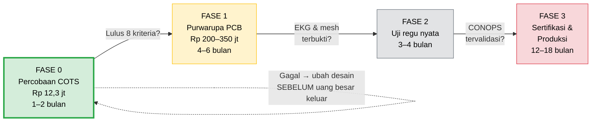

---

## 2. Masalah & Angka yang Membuat Desain Ini Bekerja

### Masalah inti

EKG mentah pada 250 Hz × 16 bit = **~4 kbit/detik per prajurit**.
Iridium SBD hanya membawa **340 byte per pesan**.

**Streaming EKG lewat satelit mustahil secara matematis.** Bukan mahal — mustahil.

### Solusi: triase data

Proses di perangkat, kirim **kesimpulan**, bukan gelombang.

| Jenis data | Ukuran | Kapan dikirim |
|---|---|---|
| **Paket vital rutin** | **21 byte/prajurit** | Tiap 60 detik **di dalam mesh** (gratis) |
| Laporan saksi | 8 + 2×N byte | Saat mendengar rekan/beacon |
| Ringkasan alarm (deret RR) | ~100 byte | Saat aritmia terdeteksi |
| Rekaman EKG 10 detik | ~1,5–2,5 KB | Ditunda sampai link bagus atau diminta C2 |

**Hasilnya:** 340 byte − 6 byte header = 334 ÷ 21 = **15 prajurit per satu burst satelit.**
Satu regu (8–10 orang) muat dalam **satu pesan**.

### Isi paket 21 byte

```
┌────┬────┬────┬────┬────┬────┬────┬────┬────┬────┬────┬────┬────┬────┬────┬────┬────┬────┬────┬────┬────┐
│ 0  │ 1  │ 2  │ 3  │ 4  │ 5  │ 6  │ 7  │ 8  │ 9  │ 10 │ 11 │ 12 │ 13 │ 14 │ 15 │ 16 │ 17 │ 18 │ 19 │ 20 │
├────┴────┼────┼────┴────┴────┴────┼────┴────┴────┴────┼────┴────┴────┴────┼────┼────┼────┼────┼────┼────┤
│soldier  │seq │    timestamp      │       lat         │       lon         │ hr │hrv │spo2│temp│batt│flag│
│  _id    │    │   (unix, u32)     │     (×1e7)        │     (×1e7)        │bpm │rmssd│ %  │ °C │ %  │ s  │
│  (u16)  │(u8)│                   │      (i32)        │      (i32)        │(u8)│(u8)│(u8)│(u8)│(u8)│(u8)│
└─────────┴────┴───────────────────┴───────────────────┴───────────────────┴────┴────┴────┴────┴────┴────┘
```

**Bit flag (byte 20):**
| Bit | Arti |
|---|---|
| 0 | SOS ditekan |
| 1 | Casualty terdeteksi |
| 2 | Aritmia terdeteksi |
| 3–4 | Sumber posisi (GNSS / dead-reckoning / trilaterasi RSSI / basi) |
| 5 | **Strap dada terhubung** ← kritis, lihat catatan di bawah |
| 6 | Baterai lemah |
| 7 | Heat stress |

> **Catatan penting.** Karena tidak ada sensor PPG di pergelangan, **strap dada dilepas = tidak ada vital sama sekali.** Bit 5 karena itu naik dari sekadar informatif menjadi **kritis** — dashboard wajib menampilkan "TANPA VITAL", bukan angka terakhir yang diketahui.

### Ekonomi satelit — ini pembatas desain, bukan detail operasional

Untuk 1 regu (8 prajurit + 1 gateway) = 8 × 21 + 6 = **174 byte per burst**:

| Cadensi uplink | Data/bulan | Biaya/bulan/regu |
|---|---|---|
| Tiap 60 detik | ~7,5 MB | **~$10.000 — mustahil** |
| Tiap 15 menit | ~500 KB | ~$450–725 |
| Tiap 30 menit | ~250 KB | ~$225–365 |
| Tiap 60 menit | ~125 KB | ~$110–180 |

**Kesimpulan yang mengubah segalanya:** cadensi mesh (60 detik, gratis) **berbeda** dari cadensi satelit (15–30 menit, dibayar per byte). Mesh bukan sekadar soal jangkauan — mesh adalah **mekanisme penghemat biaya** yang mengubah "N prajurit × sering" menjadi "1 link × jarang".

---

## 3. Arsitektur Sistem

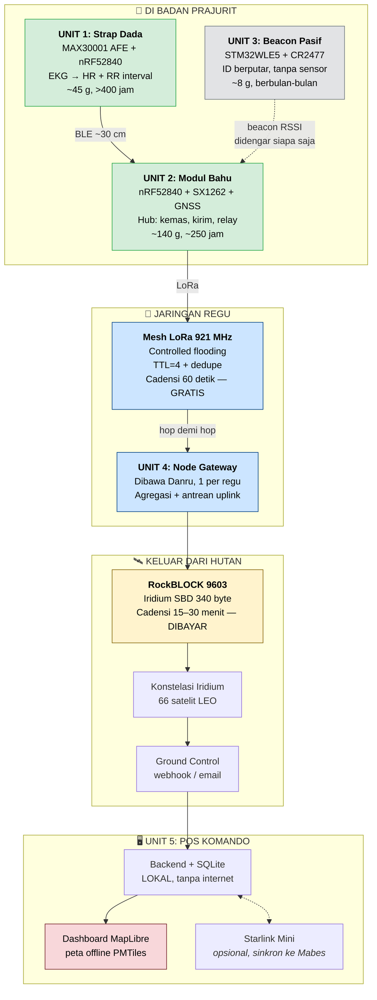

### Kenapa mesh multi-hop wajib, bukan pilihan

Regu menyebar 200–500 m. Jangkauan nyata di hutan lebat ~400 m. Artinya prajurit terjauh **tepat di ambang batas** satu hop.

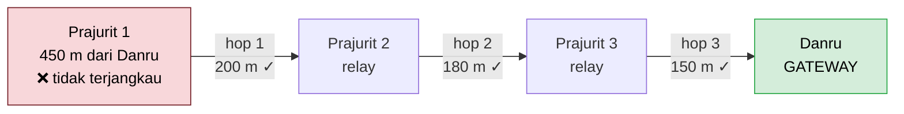

**Dua mekanisme yang wajib menyertai flooding:**

| Mekanisme | Fungsi | Akibat jika tidak ada |
|---|---|---|
| **TTL / batas hop** (=4) | Membatasi berapa kali paket diteruskan | Paket berputar selamanya di dalam mesh |
| **Dedupe** `(source_id, seq_num)` | Membuang paket yang sudah pernah dilihat | Paket **berlipat ganda eksponensial** — mesh lumpuh sendiri |

### Store-and-carry: pergerakan prajurit jadi alat angkut data

Kalau prajurit tidak bisa menjangkau **siapa pun**, paket disimpan di flash. Saat ia kembali masuk jangkauan siapa saja — bisa berjam-jam kemudian — seluruh buffer dilimpahkan.

> Prajurit yang terpisah 3 jam kembali membawa **riwayat 3 jam penuh dengan stempel waktu yang benar**. Karena itu backend wajib menangani timestamp tidak berurutan sejak hari pertama.

### Tiga sumber posisi — dan kenapa dashboard wajib membedakannya

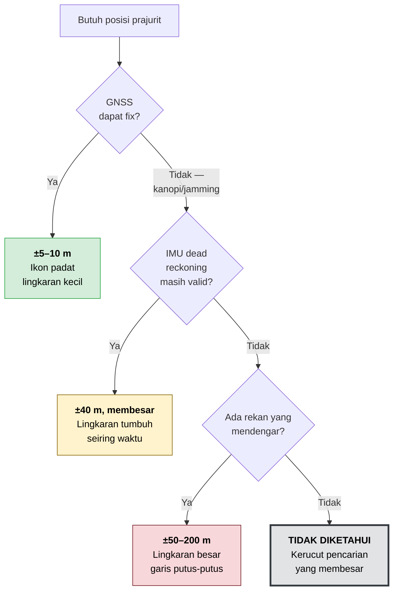

> **Komandan tidak boleh sampai salah membaca perkiraan ±150 m sebagai fix GPS ±8 m.** Ini persyaratan tampilan, bukan hiasan.

---

## 4. Penempatan di Tubuh Prajurit

```
                        ╔═══════════════════════════════════════╗
                        ║   PENEMPATAN 3 UNIT DI TUBUH          ║
                        ╚═══════════════════════════════════════╝

                                    (  ͡° ͜ʖ ͡°)
                                   ╱───────────╲
                                  │             │
              ┌───────────────┐   │             │
              │  UNIT 2       │◄──┤▓▓▓         │        ← TALI BAHU SISI
              │  MODUL BAHU   │   │▓▓▓          │          NON-MENEMBAK
              │  ~140 g       │   │▓▓▓          │          (kiri utk penembak kanan)
              │  ≤18 mm tebal │   │             │
              └───────────────┘   │             │
                    ▲             │             │
                    │ antena LoRa │             │
                    │ pipih naik  │             │
                    │ sepanjang   │  ┌───────┐  │
                    │ tali bahu   │  │UNIT 1 │  │        ← STRAP DADA
                    │             │  │ ~45 g │  │          melingkar dada,
                    └─────────────┼──┤≤10 mm │  │          DI BAWAH seragam
                                  │  └───────┘  │
                                  │      ▲      │
                                  │      │ pod di kiri,
                                  │      │ BUKAN di sternum
                                  │             │
                                  │  ░░░░░░░░░  │        ← UNIT 3
                                  │  ░ BEACON ░ │          BEACON PASIF
                                  │  ░  ~8 g  ░ │          dijahit di seragam
                                  │  ░░░░░░░░░  │          / sol sepatu / dogtag
                                  ╲             ╱
                                   ╲___________╱
                                     │       │
                                     │       │

  ┌──────────────────────────────────────────────────────────────────────────┐
  │  PERGELANGAN TANGAN: KOSONG — bebas untuk senjata, sarung tangan,        │
  │  dan cheek weld. Ini keputusan desain, bukan kelalaian.                  │
  └──────────────────────────────────────────────────────────────────────────┘
```

### Target kenyamanan — angka, bukan harapan

| Unit | Berat | Tebal | Letak | Alasan letak |
|---|---|---|---|---|
| **Strap Dada** | **≤ 45 g** (pod ≤ 22 g) | **≤ 10 mm** | Dada, pod digeser ke **kiri** di bawah otot dada | Sternum adalah titik tumpu pelat rompi. Pod di sana = nyeri saat tiarap dan saat menembak |
| **Modul Bahu** | **≤ 140 g** | **≤ 18 mm** | Tali bahu **sisi non-menembak** | Sisi menembak bertabrakan dengan popor senjata |
| **Beacon Pasif** | **≤ 8 g** | **≤ 5 mm** | Dijahit di seragam/sol/dogtag | Domain kegagalan terpisah total dari Modul Bahu |

### Enam aturan kenyamanan yang tidak boleh dilanggar

| # | Aturan | Kalau dilanggar |
|---|---|---|
| 1 | **Pod strap dada harus bisa dilepas** (konektor snap) | Band tidak bisa dicuci. 72 jam keringat tropis tanpa cuci = maserasi kulit & infeksi jamur |
| 2 | **Elektroda ditenun ke band, bukan ditempel** | Elektroda tempel mengelupas dalam hitungan hari |
| 3 | **Band lebar 30–35 mm, tepi seamless, berpori** | Band sempit memotong kulit; band rapat menahan keringat |
| 4 | **Titik silikon anti-melorot di sisi dalam band** | Strap melorot = kontak elektroda putus = data hilang |
| 5 | **Antena bahu pipih, bukan whip kaku** | Whip menyangkut ranting dan patah di hari pertama |
| 6 | **Tombol SOS menonjol & bercekung** | Harus bisa dicari dengan jari bersarung tangan, tanpa melihat, dalam gelap |

---

## 5. Peta Fase Proyek

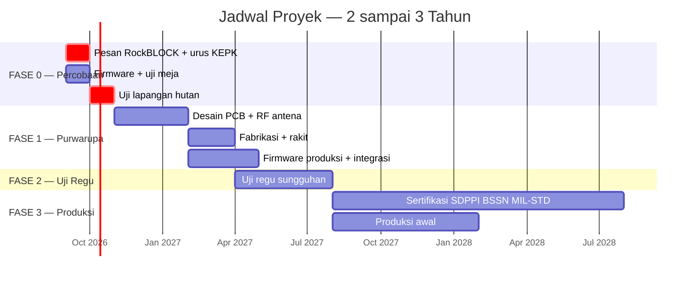

### Gerbang antar fase — apa yang harus lulus sebelum lanjut

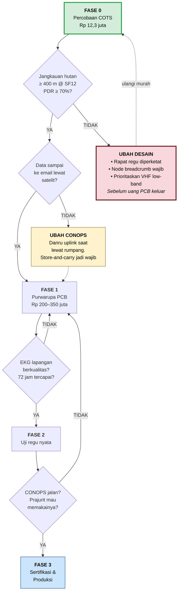

> **Kalau Fase 0 gagal, itu bukan kegagalan — itu hasil paling berharga di seluruh proyek**, karena ia mengubah desain saat biayanya masih Rp 12 juta, bukan Rp 350 juta.

---

## 6. FASE 0 — Percobaan Lapangan (Rp 12,3 juta)

**Durasi: 1–2 bulan. Tujuan: membuktikan asumsi, bukan membangun produk.**

### Yang dibuktikan

| # | Pertanyaan | Kenapa penting |
|---|---|---|
| 1 | Berapa meter LoRa tembus kanopi hutan Indonesia? | Seluruh arsitektur berdiri di atas angka ini |
| 2 | Multi-hop benar bekerja? | Kalau tidak, topologi regu harus dirombak |
| 3 | Data EKG selamat melewati radio sempit + multi-hop? | Membuktikan triase data 21-byte tidak merusak sinyal |
| 4 | Berapa untung antena naik ke bahu? | Hipotesis 5–10 dB — perbaikan fisik terbesar |
| 5 | Paket 21-byte bisa diisi penuh hardware nyata? | Memvalidasi format kabel sebelum firmware produksi |
| 6 | **Data benar-benar keluar dari hutan tanpa internet?** | Ini bukti yang meyakinkan siapa pun |
| 7 | Berapa lama sesi satelit di bawah kanopi vs terbuka? | Menentukan CONOPS uplink Danru |

### Rangkaian uji

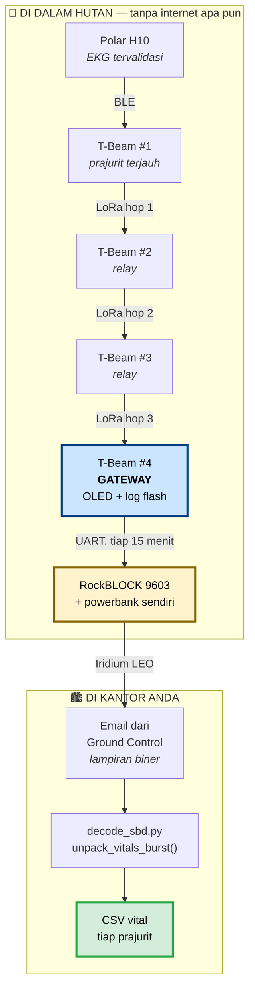

### Daftar belanja — Rp 12,3 juta

| # | Barang | Qty | Harga/unit | Total | Fungsi |
|---|---|---|---|---|---|
| 1 | **LilyGo T-Beam** 915 MHz, GPS NEO-M8N | 4 | Rp 550.000 | Rp 2.200.000 | ESP32 + LoRa + GPS + OLED + PMU jadi satu. 3 prajurit + 1 gateway |
| 2 | **Antena LoRa 915 MHz** 5 dBi SMA | 5 | Rp 75.000 | Rp 375.000 | 4 pakai + 1 cadangan |
| 3 | Kabel ekstensi SMA 50 cm | 4 | Rp 45.000 | Rp 180.000 | Uji antena di saku vs di bahu |
| 4 | Baterai 18650 LG/Samsung asli | 8 | Rp 75.000 | Rp 600.000 | 2 per node |
| 5 | Charger 18650 4-slot | 1 | Rp 85.000 | Rp 85.000 | Isi ulang di basecamp |
| 6 | Kotak IP67 + cable gland | 4 | Rp 120.000 | Rp 480.000 | Hutan hujan berarti hujan |
| 7 | Silica gel + dry bag | 1 set | Rp 50.000 | Rp 50.000 | Kondensasi tropis |
| 8 | **Polar H10** | 2 | Rp 1.400.000 | Rp 2.800.000 | EKG tervalidasi 600+ studi. 1 uji + 1 cadangan |
| 9 | Meteran pita 50 m + pita penanda | 1 set | Rp 150.000 | Rp 150.000 | Transek pembanding |
| 10 | Kabel USB-C **data** | 2 | Rp 40.000 | Rp 80.000 | Flash & tarik log |
| | | | *Subtotal mesh+EKG* | *Rp 7.000.000* | |
| 11 | **RockBLOCK 9603** | 1 | Rp 4.500.000 | Rp 4.500.000 | **PESAN HARI 1** — impor 1–3 minggu |
| 12 | Sewa line + kredit airtime | 1 | Rp 500.000 | Rp 500.000 | 1 kredit = 50 byte |
| 13 | Powerbank 10.000 mAh | 1 | Rp 300.000 | Rp 300.000 | **Wajib** — RockBLOCK sedot ratusan mA |
| | | | **TOTAL** | **Rp 12.300.000** | |

### Lima jebakan pembelian paling mahal

| Jebakan | Akibat |
|---|---|
| **Antena salah band** | Nagoya NA-771 adalah antena **144/430 MHz**, bukan 915 MHz. Dipakai di 921 MHz = SWR tinggi, hasil kacau, PA bisa rusak. Cari yang tertulis **"915 MHz"** atau **"868/915 MHz LoRa"** |
| **Menyalakan node tanpa antena** | Merusak penguat daya permanen. Tempel stiker peringatan di tiap kotak |
| **GPS varian NEO-6M** | Hanya GPS, tanpa GLONASS/Galileo. Kepayahan di bawah kanopi. **Minta NEO-M8N** |
| **RockBLOCK dipesan belakangan** | Tiang terpanjang: impor 1–3 minggu + bea cukai + aktivasi akun |
| **RockBLOCK dicatu dari 18650 node** | Arus puncak menyebabkan brown-out → gateway reset → buffer hilang |

### Yang harus dikoding (~750 baris)

| # | Berkas | Isi |
|---|---|---|
| 0 | Perbaiki `mesh/router.py` | `hop_count` kurang 1 pada hop terakhir masuk gateway — increment harus terjadi saat *receive*, sebelum cek `is_gateway` |
| 1 | `protocol/tracker_protocol/frame.py` **(baru)** | Frame mesh **4 byte**: `ver_type / ttl / hop_count / payload_len`. Total di udara **25 byte** |
| 2 | `firmware/node/` | Arduino ESP32: BLE ke Polar H10, GPS, susun paket 21-byte, flooding + dedupe + TTL dengan **jitter acak 0–2 detik** |
| 3 | `firmware/gateway/` | LoRa RX → simpan mentah → tiap 15 menit susun burst → `AT+SBDWB`/`AT+SBDIX` ke RockBLOCK, coba ulang saat gagal |
| 4 | `tools/field_logger.py` | Serial → decode → CSV + tabel terminal |
| 5 | `tools/decode_sbd.py` | Lampiran email → `unpack_vitals_burst()` → CSV. **Di bawah 50 baris** |

> **Trik yang memotong separuh kerja firmware:** gateway **tidak mendekode apa pun** — ia meneruskan byte mentah. Yang mendekode adalah `tracker_protocol` Python yang sudah lulus 29/29 tes. Firmware hanya butuh *encoder*, dan format kabel dijamin tidak melenceng karena pembacanya adalah sumber kebenaran itu sendiri.

### Setelan radio — jangan pakai default

| Parameter | Nilai | Alasan |
|---|---|---|
| Frekuensi | **921,4 MHz** | Default banyak contoh adalah 915,0 MHz — **di luar** alokasi Indonesia 920–923 MHz |
| Bandwidth | 125 kHz | Baku |
| Spreading factor | **Uji SF7 dan SF12** | Selisihnya adalah hasil paling berharga. SF12 = +~10 dB, ongkos airtime ×32 |
| Daya pancar | **Verifikasi batas legal** | KEPMEN KOMINFO 5/2024. 20 dBm + antena 5 dBi = 25 dBm EIRP, kemungkinan melewati batas. **Uji harus pakai daya legal**, kalau tidak hasilnya melebih-lebihkan kenyataan |
| TTL awal | 4 | Sesuai `C.DEFAULT_TTL` |

### Prosedur uji

**Hari 0 — meja & lapangan terbuka (SEBELUM masuk hutan)**
1. Uji meja 4 node: buktikan flooding + dedupe + TTL, CSV terisi benar
2. **Kirim burst satelit dari halaman kantor** — pastikan lampirannya benar-benar tiba di email. *Men-debug Iridium di tengah hutan adalah penderitaan yang bisa dihindari*
3. Transek pembanding di lapangan terbuka per 50 m — **ini referensinya**, tanpa itu hasil hutan tidak bisa diterjemahkan jadi "berapa dB hilang karena dedaunan"

**Hari 1 — hutan**
- Transek per 50 m, berhenti 5 menit tiap titik (= 5 paket)
- Ulangi untuk **SF7** dan **SF12**
- Ulangi untuk **antena di saku** vs **antena di bahu**
- Multi-hop: relay di titik tengah, dorong node melewati batas satu hop
- EKG: relawan pakai Polar H10, rekam juga di Polar Flow sebagai pembanding
- **Satelit di 3 penempatan gateway:** tegakan rapat / rumpang / punggungan
- **Alarm:** tekan SOS di node terjauh, catat waktu sampai email tiba

**Dicatat tiap titik:** jarak GPS, SF, daya pancar, posisi antena, PDR, RSSI, SNR, `hop_count`, kerapatan vegetasi, cuaca, waktu.

> **Gerbang KEPK.** Jangan pasang elektroda ke kulit siapa pun sebelum surat persetujuan Komisi Etik di tangan. Transek jangkauan boleh jalan lebih dulu dengan `hr=0` — jadwal tidak tersandera.

### Kriteria lulus

| # | Kriteria | Ambang |
|---|---|---|
| 1 | Jangkauan 1 hop, hutan lebat, SF12 | PDR ≥ 70% pada **≥ 400 m** |
| 2 | Multi-hop | Paket dari luar jangkauan gateway sampai, `hop_count` benar |
| 3 | Integritas EKG | HR & RMSSD cocok dengan rekaman Polar Flow |
| 4 | Hipotesis antena | Selisih bahu vs saku terukur dan positif |
| 5 | Dedupe & TTL | Tidak ada paket berlipat; flood berhenti sesuai TTL |
| 6 | **Rantai penuh tanpa internet** | Vital dari hutan **tiba di email** dan terdekode benar |
| 7 | SBD di bawah kanopi | Persentase sesi berhasil & durasi rata-rata, 3 penempatan |
| 8 | Latensi alarm | Waktu SOS → email tiba, tercatat sebagai angka |

---

## 7. FASE 1 — Purwarupa Terintegrasi

**Durasi: 4–6 bulan. Baru dimulai setelah Fase 0 lulus.**

Di sini barulah PCB dibuat. Komponennya **sudah dirampingkan** — lihat [bagian 8](#8-perampingan-komponen--apa-yang-dipotong-dan-kenapa) untuk alasan tiap pemotongan.

### UNIT 1 — Strap Dada

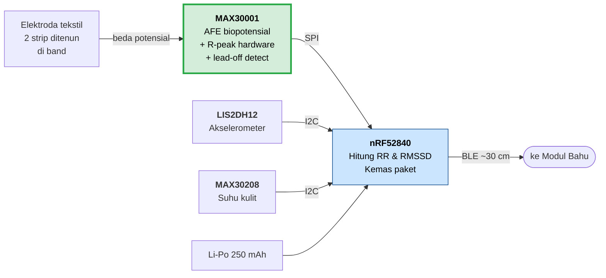

| # | Komponen | Part | Fungsi | Ukuran |
|---|---|---|---|---|
| 1 | AFE biopotensial | **MAX30001** | Menguatkan & digitalkan EKG. **R-peak detector di hardware** → MCU boleh tidur (inti penghematan daya). **Lead-off detection-nya sekaligus jadi sensor lepas-badan** — nol komponen tambahan | 3×3 mm |
| 2 | MCU + BLE | **nRF52840** | Baca AFE, hitung RR/RMSSD, kirim ke Modul Bahu | 7×7 mm |
| 3 | Akselerometer | **LIS2DH12** | Tolak artefak gerak dari sinyal EKG | 2×2 mm |
| 4 | Suhu kulit | **MAX30208** | Heat stress / hipotermia. Satu-satunya unit yang menyentuh kulit | 2×2 mm |
| 5 | Elektroda tekstil | Benang perak **ditenun** | Kontak kulit tanpa gel, tahan keringat, bisa dicuci | 40×15 mm ×2 |
| 6 | Baterai Li-Po | **250 mAh** | Lihat anggaran daya di bawah | 25×20×4 mm |
| 7 | Konektor snap | — | **Pod lepas-pasang agar band bisa dicuci** — wajib | IP67 |
| 8 | Band elastis | Rajut nilon/elastane | Tekanan elektroda konsisten, berpori, silikon anti-melorot | 30–35 mm |

**Anggaran daya:**

| Beban | Konsumsi |
|---|---|
| MAX30001 mode EKG | ~85 µA |
| nRF52840 + BLE 1 detik | ~300–600 µA |
| LIS2DH12 low-power | ~10 µA |
| MAX30208 (siklus kerja) | ~20 µA |
| **Rata-rata** | **~0,45–0,75 mA** |
| **Daya tahan** | **250 mAh ÷ 0,6 mA ≈ 415 jam (17 hari)** |

**Biaya: $38–58/unit** (volume 1.000)

---

### UNIT 2 — Modul Bahu (Hub Prajurit)

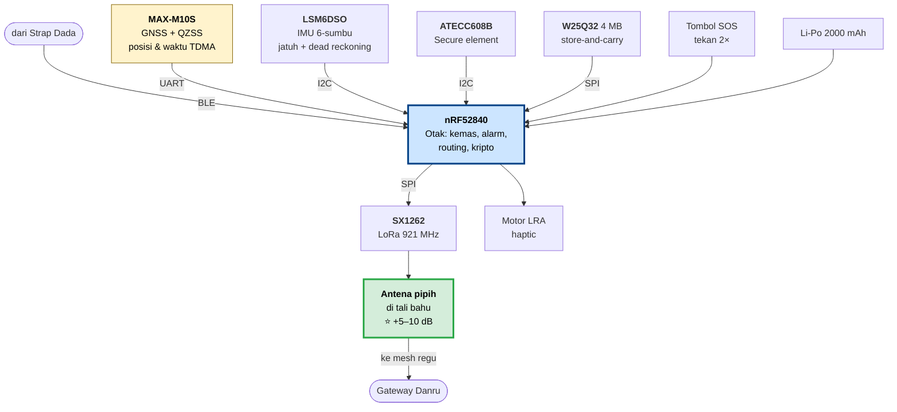

| # | Komponen | Part | Fungsi |
|---|---|---|---|
| 1 | MCU utama | **nRF52840** | Otak: BLE (terima strap), koordinasi LoRa, logika alarm, kriptografi |
| 2 | Transceiver LoRa | **SX1262** | Radio mesh 920–923 MHz, relay hop demi hop |
| 3 | **Antena LoRa pipih** | Flex/PCB **di tali bahu** | ⭐ **Komponen paling menentukan jangkauan di seluruh sistem.** Layak dianggarkan waktu desain RF tersendiri |
| 4 | Modul GNSS | **u-blox MAX-M10S** | Posisi ±5–10 m, QZSS (bantu di kanopi Asia-Pasifik), deteksi jamming, **dan sinkronisasi waktu mikrodetik untuk slot TDMA** |
| 5 | IMU 6-sumbu | **LSM6DSO** | Deteksi jatuh, dead-reckoning saat GNSS hilang, **dan sensor "modul dilepas dari rompi"** |
| 6 | Secure element | **ATECC608B** | Kunci kripto unik per-perangkat yang tidak bisa diekstrak. **Jangan diganti** — murah dan kritis |
| 7 | Flash eksternal | **W25Q32** (4 MB) | Buffer store-and-carry saat mesh terputus |
| 8 | Baterai Li-Po | **2000 mAh** | Lihat anggaran daya. **Di sini sengaja TIDAK dirampingkan** |
| 9 | Motor haptic | LRA | Satu-satunya umpan balik: alarm & konfirmasi SOS. Tanpa buzzer/layar demi disiplin cahaya & suara |
| 10 | Tombol SOS | — | **Tekan dua kali** untuk cegah salah pencet. Menonjol & bercekung |
| 11 | Kontak pengisian | Pogo-pin magnetik | Modul di luar seragam & tidak terendam → pogo-pin IP67 lebih murah & cepat daripada Qi |
| 12 | Enclosure | — | IP67, MOLLE/PALS, low-profile, tahan benturan |

**Anggaran daya:**

| Beban | Konsumsi |
|---|---|
| nRF52840 + BLE ke strap | ~1–2 mA |
| SX1262 mesh, RX ber-slot TDMA | ~1–2 mA |
| **MAX-M10S GNSS (siklus kerja)** | **~5 mA ← pemakan daya terbesar** |
| LSM6DSO | ~0,2 mA |
| **Rata-rata** | **~7–9 mA** |
| **Daya tahan** | **2000 mAh ÷ 8 mA ≈ 250 jam (10 hari)** |

> **Yang boros bukan transmisi LoRa (~0,2 mA rata-rata), melainkan GNSS dan RX mesh yang selalu mendengar.** Itu sebabnya slot TDMA wajib — dan sinkronisasi waktunya datang **gratis** dari GNSS di baris 4.

**Biaya: $62–102/unit** (volume 1.000)

---

### UNIT 4 — Node Gateway (Danru, 1 per regu)

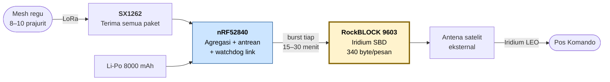

| # | Komponen | Part | Fungsi |
|---|---|---|---|
| 1 | Modem satelit | **RockBLOCK 9603** (Iridium SBD) | Jalur uplink yang sudah terbukti hari ini |
| 2 | Transceiver LoRa | **SX1262** | Terima semua paket mesh regu, susun batch |
| 3 | MCU pengatur | **nRF52840** | Agregasi paket regu, antrean uplink, watchdog |
| 4 | Baterai Li-Po | **8000 mAh** | ~130 jam. Beban lebih tinggi karena radio satelit |
| 5 | Antena satelit + LoRa eksternal | — | **Inilah alasan topologi hub-and-spoke dipilih** — antena layak tidak muat di perangkat pakai |
| 6 | Enclosure rugged | — | IP67, MOLLE-mountable, tahan guncangan |

> **Catatan operasional.** Iridium bekerja di 1,6 GHz dan menembus kanopi **hanya sebagian**. Danru harus bisa menempatkan antena di rumpang, tepi sungai, atau punggungan. Seberapa parah kanopi memperlambat sesi SBD adalah salah satu hasil yang dicari di Fase 0.
>
> **Titik lemah yang belum tertutup:** topologi 1 gateway per regu. Gateway hancur = regu buta. Layak ditinjau ulang setelah Fase 2.

**Biaya: $165–265/unit** (volume 1.000)

---

### UNIT 5 — Pos Komando

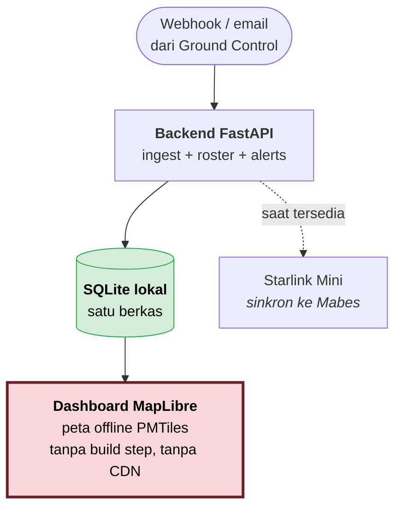

| # | Komponen | Fungsi |
|---|---|---|
| 1 | Mini-PC / laptop rugged | Menjalankan backend + dashboard **lengkap secara lokal** |
| 2 | SQLite | Nol setup, satu berkas, jalan di Windows. Skema dirancang agar bisa pindah ke TimescaleDB tanpa tulis ulang |
| 3 | Peta offline **PMTiles** | Satu berkas, tanpa server tile, tanpa internet. **Syarat mutlak**, bukan kemewahan |
| 4 | Starlink Mini *(opsional)* | Sinkronisasi ke Mabes saat tersedia |
| 5 | UPS / daya kendaraan | Starlink Mini menyedot 16–40 W |

> **Aturan yang tidak boleh dilanggar:** dashboard pos komando **wajib tetap berfungsi penuh saat Starlink putus.** Starlink adalah sinkronisasi ke belakang, bukan tulang punggung. Data disimpan lokal lebih dulu.

**Apa yang harus terlihat di dashboard:**
- Peta, tiap prajurit berwarna sesuai status (hijau / kuning / merah / **abu-abu = tidak ada kontak**)
- **Keusangan data sebagai warga kelas satu:** "terakhir terlihat 4 menit lalu". Di lingkungan comms-denied, tahu bahwa data sudah basi sama pentingnya dengan datanya sendiri
- **Asal-usul posisi dibedakan visual** (GNSS / dead-reckoning / trilaterasi) dengan lingkaran ketidakpastian sesuai [bagian 3](#tiga-sumber-posisi--dan-kenapa-dashboard-wajib-membedakannya)
- Panel alarm + detail per prajurit (strip EKG, tren HR/HRV, jejak lintasan)

---

## 8. Perampingan Komponen — Apa yang Dipotong dan Kenapa

Prinsipnya: **potong yang datanya tidak punya tujuan, atau yang fungsinya sudah ditutup komponen lain.** Bukan memotong sampai sistemnya pincang.

### Yang DIPOTONG

| Komponen | Ada di | Alasan dipotong | Hemat |
|---|---|---|---|
| **BMP390** barometer | Modul Bahu | **Paket 21-byte tidak punya field ketinggian.** Datanya secara harfiah tidak punya tempat untuk pergi. Deteksi jatuh sudah ditangani IMU dengan signature free-fall + impact | −$3,00 |
| **BMM350** magnetometer | Modul Bahu | Tujuannya "kompas taktis" — tapi **tidak ada layar untuk menampilkan arah**. Ditambah: senapan, pelat rompi, dan radio di badan prajurit merusak akurasi magnetometer. Arah untuk dead-reckoning bisa diambil dari *course-over-ground* GNSS. Bonus: hilang juga beban kalibrasi hard-iron/soft-iron di firmware | −$2,80 |
| **nRF9151** | Node Gateway | Nilainya adalah fallback seluler LTE-M — tapi **premis proyek ini adalah wilayah tanpa BTS**. Di hutan ia tidak menambah apa pun, sementara ia membawa serta seluruh alur kerja SIM & sertifikasi seluler | −$32,00 |
| **Panel surya** | Node Gateway | Sudah ditandai opsional. Ditunda ke Fase 2 saat kebutuhan misi >72 jam terbukti nyata | ditunda |
| **Unit 3 Beacon Pasif** | — | Ini lapisan redundansi, bukan fungsi inti. **Ditunda ke Fase 2** — jangan dibangun sebelum jalur utamanya terbukti | ditunda |

### Yang DITURUNKAN (bukan dipotong)

| Dari | Ke | Ada di | Alasan | Hemat |
|---|---|---|---|---|
| **nRF5340** | **nRF52840** | Modul Bahu, Gateway | Dual-core dibenarkan kalau timing radio keras — tapi TDMA pada cadensi 60 detik bukan hard real-time, dan kriptografinya sudah ditangani ATECC608B. **Untung terbesarnya bukan uang: seluruh sistem jadi satu keluarga MCU**, satu SDK, satu dev kit, satu basis firmware | −$3,50 ×2 |
| **ICM-42688-P** | **LSM6DSO** | Modul Bahu | Dead-reckoning yang direncanakan adalah PDR berbasis hitung langkah, bukan strapdown INS — tidak menuntut stabilitas bias gyro kelas atas | −$3,00 |
| **ICM-42688-P** | **LIS2DH12** | Strap Dada | Tugasnya hanya "apakah badan sedang bergerak" untuk menolak artefak EKG. Itu butuh akselerometer, **tidak butuh giroskop**. Bonus: konsumsi turun dari ~250 µA ke ~10 µA | −$4,30 |
| **W25Q128** (16 MB) | **W25Q32** (4 MB) | Modul Bahu | Vital 21 byte tiap 60 detik = ~30 KB/hari/orang. 4 MB menampung buffer epidemik satu regu penuh selama berhari-hari. 16 MB adalah kelebihan yang tidak akan pernah terpakai | −$0,80 |

### Yang sengaja TIDAK dirampingkan

Sama pentingnya untuk dinyatakan — ini bukan kelalaian:

| Komponen | Kenapa dipertahankan |
|---|---|
| **Baterai 2000 mAh** di Modul Bahu | Bisa saja turun ke 1500 mAh dan tetap lulus target 72 jam. **Tidak dilakukan** — margin daya adalah hal terakhir yang boleh dipangkas di lapangan, terutama karena mode eskalasi SF12 jauh lebih boros dan kapasitas sel turun seiring usia |
| **ATECC608B** | Sudah murah ($1,20) dan kritis untuk autentikasi paket & skema *heartbeat-or-wipe* |
| **MAX-M10S** GNSS | Modul lebih murah ada, tapi kehilangan **QZSS** (justru berguna di Indonesia) dan deteksi jamming |
| **MAX30001** | R-peak detector di hardware-nya adalah inti penghematan daya strap dada. AD8232 sepertiga harganya tapi analog saja dan jauh lebih berisik |
| **Polar H10 ×2** di Fase 0 | Kegagalan kontak elektroda kering karena keringat adalah mode kegagalan paling umum di EKG lapangan. Cadangan paling berharga justru di titik yang paling sering gagal |

### Hasil perampingan

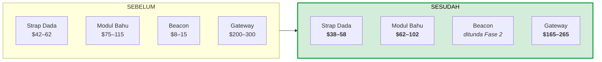

| | Sebelum | Sesudah | Selisih |
|---|---|---|---|
| **Per prajurit** (strap + modul) | $117–177 | **$100–160** | −$17 (−12%) |
| **Per regu** (8 prajurit + 1 gateway) | ~$1.500 | **~$1.255** | **−$245 (−16%)** |
| **Jumlah part number berbeda** | 25 | **19** | **−6 part** |
| **Keluarga MCU** | 2 (nRF5340 + nRF52840) | **1 (nRF52840)** | satu SDK, satu dev kit |
| Arus rata-rata Strap Dada | ~1,0 mA | **~0,6 mA** | daya tahan naik 17 hari |

> **Penghematan terbesar bukan angka dolarnya, melainkan 6 part number yang hilang dan 1 keluarga MCU.** Setiap part yang dihapus berarti satu driver yang tidak perlu ditulis, satu lembar data yang tidak perlu dibaca, satu risiko pasokan yang tidak perlu dikelola, dan satu titik kegagalan yang tidak akan pernah gagal.

---

## 9. FASE 2 — Uji Regu Sungguhan

**Durasi: 3–4 bulan.**

Perbedaannya dengan Fase 0: bukan lagi menguji teknologi, tapi menguji **apakah manusia mau memakainya**.

| Yang diuji | Kenapa baru bisa sekarang |
|---|---|
| **Kenyamanan 72 jam berturut-turut** | Butuh perangkat sungguhan, bukan T-Beam di kotak plastik |
| **Kualitas EKG saat bergerak, berkeringat, di balik rompi** | Kondisi ini tidak bisa disimulasikan di lab |
| **CONOPS uplink** — kapan Danru mengirim, siapa yang memutuskan | Butuh regu sungguhan dengan komandan sungguhan |
| **EMCON** — seberapa terekspos mesh terhadap direction finding | Trade-off nyata yang harus diukur, bukan diabaikan |
| **Baterai tidak merata** — node dekat Danru merelai paling banyak | Baru terlihat pada topologi regu penuh |
| **Beban logistik** — pengisian, penggantian, perawatan | Ini yang membunuh sistem bagus di lapangan |

**Ditambahkan di fase ini:** Unit 3 (Beacon Pasif) dan panel surya gateway, kalau Fase 1 membuktikan jalur utamanya solid.

---

## 10. FASE 3 — Sertifikasi & Produksi

**Durasi: 12–18 bulan, sebagian paralel.**

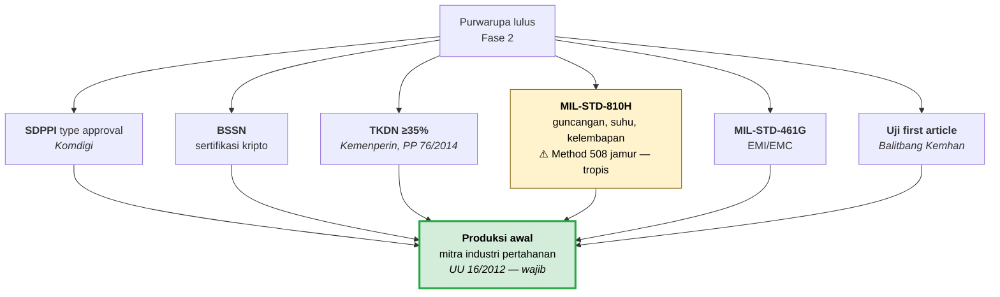

| Sertifikasi | Otoritas | Catatan |
|---|---|---|
| **SDPPI type approval** | Komdigi | Wajib untuk perangkat telekomunikasi yang dioperasikan. **Belum wajib untuk purwarupa riset** |
| **BSSN** | Badan Siber dan Sandi Negara | Sertifikasi kripto untuk penggunaan pemerintah/militer |
| **TKDN ≥ 35%** | Kemenperin | PP 76/2014 untuk pengadaan pertahanan |
| **MIL-STD-810H** | Lab uji | **Method 508 (jamur) khusus penting untuk tropis** |
| **MIL-STD-461G** | Lab uji | EMI/EMC |
| **AKL Kemenkes** | Kemenkes | **Dihindari** dengan memposisikan alat sebagai *monitor kesiapan fisiologis*, bukan alat diagnosis. Klaim "mendeteksi aritmia" akan menyeret ke jalur alat kesehatan — keputusan ini harus diambil formal dan konsisten di seluruh dokumen |
| **UU PDP 27/2022** | — | Data kesehatan = "data pribadi spesifik", perlakuan lebih ketat |

**Perkiraan biaya sertifikasi lengkap: $100–200 ribu, 6–12 bulan.**

> **Mitra industri pertahanan wajib.** UU 16/2012 mensyaratkan keterlibatan industri pertahanan dalam setiap pengadaan. Kandidat: PT LEN Industri, PT Pindad, holding Defend ID. **Ini bukan opsional untuk pengadaan TNI.**

---

## 11. Anggaran

### Per fase

| Fase | Isi | Biaya | Durasi |
|---|---|---|---|
| **Fase 0** | Kit COTS, uji lapangan hutan | **Rp 12,3 juta** | 1–2 bulan |
| **Fase 1** | Purwarupa PCB, dev kit, alat ukur, logistik | **Rp 200–350 juta** | 4–6 bulan |
| **Fase 2** | Uji regu sungguhan, iterasi | **Rp 100–200 juta** | 3–4 bulan |
| **Fase 3** | Sertifikasi + tooling produksi | **$100–200 ribu** | 12–18 bulan |

**Fase 0 hanya 3–6% dari anggaran Fase 1** — dan ia menghilangkan ketidakpastian terbesar sebelum sisanya dikeluarkan.

### Rincian Fase 1 (Rp 200–350 juta)

| Pos | Estimasi |
|---|---|
| 10 modul bahu purwarupa | Rp 25–40 jt + NRE PCB Rp 15–25 jt |
| 10 strap dada | Rp 15–25 jt |
| 2 node gateway | Rp 14–22 jt |
| Dev kit & alat ukur (nRF DK, logic analyzer, osiloskop) | Rp 30–60 jt |
| RockBLOCK + airtime uji | Rp 6–10 jt + Rp 500 rb/bln |
| Logistik uji lapangan (lokasi, personel) | Rp 20–50 jt |
| Desain RF antena tali bahu *(pos tersendiri)* | Rp 20–40 jt |
| **Total** | **Rp 200–350 juta** |

### Biaya per unit pada volume 1.000 (setelah perampingan)

| Unit | BOM/unit | Per prajurit | Per regu (8 orang) |
|---|---|---|---|
| Strap Dada | $38–58 | ✔ | $304–464 |
| Modul Bahu | $62–102 | ✔ | $496–816 |
| Node Gateway | $165–265 | — | $165–265 (1 unit) |
| *Beacon Pasif (Fase 2)* | *$8–15* | *✔* | *$64–120* |
| **Total Fase 1** | | **$100–160** ≈ Rp 1,6–2,6 jt | **$965–1.545** ≈ Rp 16–25 jt |

### Biaya operasional satelit

| Mode | Cadensi | Biaya/bulan/regu |
|---|---|---|
| **Riset** — hanya saat ada kejadian + 1 heartbeat harian | jarang | **< $30** |
| Operasional hemat | tiap 60 menit | $110–180 |
| Operasional normal | tiap 15–30 menit | $225–725 |

**Tiga cara menekannya:** kirim hanya saat ada kejadian; pakai terestrial di mana pun ada sinyal; offload lewat WiFi saat satuan kembali ke pangkalan.

---

## 12. Risiko & Mitigasi

### Pemetaan mode kegagalan

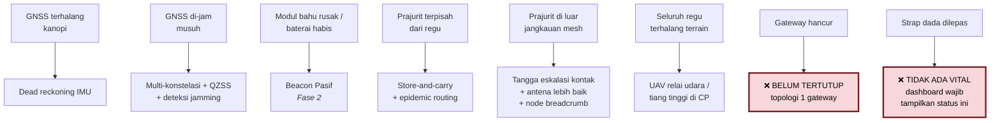

### Risiko teratas

| Risiko | Dampak | Mitigasi |
|---|---|---|
| **Jangkauan hutan jauh di bawah 400 m** | Topologi regu tidak jalan | **Inilah yang diuji Fase 0** seharga Rp 12 juta, bukan Rp 350 juta |
| **Kualitas EKG buruk saat bergerak & berkeringat** | Data tidak bisa dipakai | LIS2DH12 untuk artefak gerak; elektroda ditenun; Fase 2 menguji 72 jam nyata |
| **Gateway hancur = regu buta** | Kehilangan total satu regu | Belum tertutup. Tinjau ulang setelah Fase 2 — kandidat: gateway kedua atau peran gateway yang bisa berpindah |
| **Prajurit menolak memakainya** | Sistem bagus yang tidak dipakai | Kenyamanan dijadikan persyaratan berangka sejak awal ([bagian 4](#4-penempatan-di-tubuh-prajurit)), bukan pemikiran belakangan |
| **KEPK terlambat** | Uji EKG tertunda berminggu-minggu | **Ajukan di hari pertama.** Transek jangkauan tetap bisa jalan dengan `hr=0` |
| **RockBLOCK terlambat tiba** | Fase 0 mundur | **Pesan di hari pertama** — impor 1–3 minggu + bea cukai |
| **Lead time chip nRF/u-blox 20–50 minggu** | Fase 1 mundur | Second source untuk tiap komponen kritis; beli lebih awal |
| **Komponen palsu** | Kegagalan lapangan | Beli hanya dari distributor resmi. Masalah nyata pada chip RF dan baterai |

### Dua hal khas militer yang mudah terlewat

**EMCON (emission control).** Alat yang memancar teratur adalah suar bagi radio direction finding musuh. Wajib ada: mode senyap (terima saja), jitter acak pada waktu pancar, daya pancar adaptif serendah mungkin, burst singkat, dan penekanan laporan posisi di dalam geofence "silent". **Mesh yang banyak merelai lebih berisik daripada topologi bintang — trade-off nyata yang harus diukur di Fase 2, bukan diabaikan.**

**Risiko perangkat direbut.** Perangkat yang jatuh ke tangan musuh memberi umpan langsung posisi satuan. Penangkalnya: lead-off detection strap dada + IMU modul bahu → kunci otomatis; *heartbeat-or-wipe* (tidak ada kontak terautentikasi selama X jam → hapus kunci); remote kill dari C2; dan **kunci per-perangkat agar satu unit bocor ≠ jaringan bocor**.

---

## Lampiran — Berkas Terkait

| Berkas | Isi |
|---|---|
| [`docs/WIRING_PURWARUPA.md`](WIRING_PURWARUPA.md) | **Diagram wiring purwarupa Fase 0** — pin per pin, dokumen meja kerja |
| `excel/Purwarupa_Minimum.xlsx` | Daftar belanja Fase 0 lengkap dengan link & catatan |
| `excel/BOM_Per_Unit.xlsx` | BOM terstruktur per unit |
| `protocol/tracker_protocol/packet.py` | **Sumber kebenaran format kabel** — 29/29 tes lulus |
| `mesh/router.py` | Controlled flooding + TTL + dedupe + store-and-carry |

### Status kode saat ini

| Modul | Status |
|---|---|
| `protocol/` | ✅ **Selesai** — 29/29 tes lulus |
| `mesh/` | ⚠️ **9/11 tes** — 2 isu diketahui, lihat [Fase 0](#yang-harus-dikoding-750-baris) |
| `backend/` `simulator/` `analysis/` `dashboard/` | ⬜ Belum dimulai |

---

*Dokumen ini adalah rencana, bukan janji. Setiap angka jangkauan, biaya, dan jadwal di dalamnya adalah perkiraan sampai Fase 0 menggantinya dengan hasil pengukuran sungguhan dari hutan Indonesia.*
