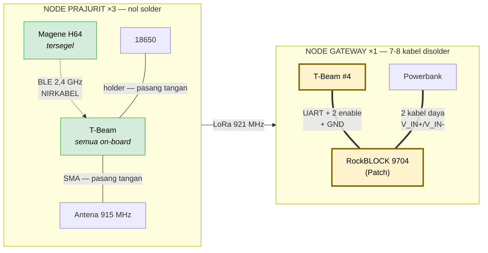
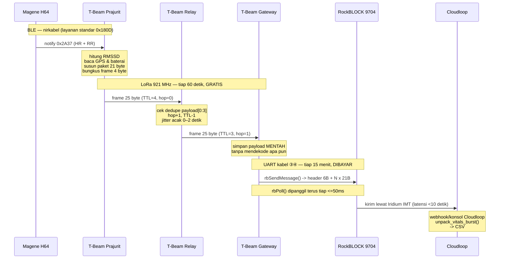

# Wiring Purwarupa Fase 0

**Dokumen meja kerja.** Cetak dan bawa ke bangku rakit. Menjelaskan komponen mana tersambung ke apa, pin per pin.

Terkait: [RENCANA_PROYEK.md](RENCANA_PROYEK.md) untuk konteks dan alasan tiap komponen.

---

## Kabar baik: seluruh sistem hanya punya SATU titik penyolderan

> ⚠️ **Update: modem satelit ganti dari RockBLOCK 9603 (SBD) ke RockBLOCK 9704 (IMT).** Konektornya, jumlah kabelnya, dan cara firmware bicara ke modemnya **semuanya berubah** — bukan cuma ganti nama part. Detail lengkap di Bagian 2 & 3.4.

Sebelum masuk detail, ini gambaran besarnya supaya tidak ada yang dikerjakan sia-sia:

| Bagian | Perlu disolder? | Kenapa |
|---|---|---|
| **Strap dada (Magene H64)** | ❌ **Tidak ada kabel sama sekali** | Produk jadi tersegel. Tersambung ke node lewat **BLE nirkabel**. Membukanya justru merusak kedap airnya |
| **Node prajurit (T-Beam ×3)** | ❌ Tidak | Semua sudah tersambung di dalam papan. Anda hanya memasang **antena** dan **baterai** |
| **Node gateway (T-Beam #4)** | ✅ **Ya — 7–8 kabel** | Satu-satunya penyolderan di seluruh proyek: T-Beam ↔ RockBLOCK 9704 ↔ powerbank |



> Diagram gateway tidak lagi menunjukkan antena Iridium eksternal — varian **Patch** yang dipilih punya antena menyatu di board. Kalau Anda pakai varian **SMA**, tambahkan kembali kabel antena ke soket SMA seperti pola node prajurit.

---

# BAGIAN 1 — Node Prajurit (×3)

## 1.1 Strap dada: tidak ada kabel, hanya BLE

**Magene H64 adalah perangkat tersegel.** Jangan dibongkar, jangan disolder. Sambungannya murni perangkat lunak.

### Pemasangan fisik

```
        ┌──────────────────────────────────────────┐
        │   BAND ELASTIS POLAR (tekstil)           │
        │                                          │
        │   ▓▓▓▓▓▓▓▓        ┌──────┐      ▓▓▓▓▓▓▓▓ │
        │   ELEKTRODA       │ POD  │      ELEKTRODA│
        │   (basahi!)       │ H10  │      (basahi!)│
        │                   └──┬───┘               │
        └──────────────────────┼───────────────────┘
                               │
                    2 kancing snap logam
                    (pod tinggal ditekan
                     sampai bunyi klik)
```

| Langkah | Catatan |
|---|---|
| 1. Tekan pod H10 ke 2 kancing snap di band | Ada bunyi klik. Kalau longgar, kancingnya aus |
| 2. **Basahi kedua strip elektroda dengan air** | ⚠️ **Ini penyebab nomor satu sinyal EKG jelek.** Elektroda kering = data sampah. Basahi ulang kalau uji lebih dari 1 jam di cuaca kering |
| 3. Pakai melingkar dada, tepat di bawah otot dada | Kencang tapi tidak menyakitkan. Melorot = kontak putus |
| 4. Pod menyala otomatis saat mendeteksi kontak kulit | Tidak ada tombol daya |

### Sambungan BLE — ini "wiring" versi perangkat lunaknya

```
   MAGENE H64                                   T-BEAM (ESP32)
   ─────────                                    ──────────────
   Advertise nama                               NimBLE scan
   "Magene H64 XXXXXXXX"  ────────────────────►  cocokkan nama/MAC
                                                        │
                         ◄───── connect ────────────────┘
                                                        │
   Service 0x180D (Heart Rate)                          │
     └─ Char 0x2A37 (HR Measurement) ──── notify ──────►│ HR + RR interval
                                                        │
   Service 0x180F (Battery)                             │
     └─ Char 0x2A19 (Battery Level) ────── read ───────►│ % baterai strap
```

| Yang dipakai | UUID | Mode | Isi |
|---|---|---|---|
| Heart Rate Service | `0x180D` | — | Layanan standar Bluetooth SIG, **bukan** milik merek tertentu |
| Heart Rate Measurement | `0x2A37` | **notify** | Detak + deret RR interval |
| Battery Service | `0x180F` | — | |
| Battery Level | `0x2A19` | read | Persen baterai strap |

> **Kenapa ini penting.** HR dan RR interval tersedia lewat **layanan BLE standar** — tidak butuh SDK khusus merek apapun, tidak butuh UUID kustom. Chest strap merek lain (Polar H10, Wahoo TICKR, dst) memakai layanan yang sama persis — firmware ini bekerja untuk semuanya tanpa perubahan. Paket 21-byte hanya perlu HR dan RMSSD, dan keduanya bisa dihitung dari RR interval.

### Membaca isi notifikasi `0x2A37`

```
byte 0 : FLAGS
         bit 0 → 0 = HR berukuran uint8 ; 1 = HR berukuran uint16
         bit 3 → 1 = ada field "energy expended" (2 byte)
         bit 4 → 1 = ADA DERET RR INTERVAL   ← yang kita butuhkan
byte 1     : HR (uint8)          ← kalau bit 0 = 0
byte 1-2   : HR (uint16 LE)      ← kalau bit 0 = 1
[2 byte]   : energy expended     ← hanya kalau bit 3 = 1
sisanya    : RR interval, uint16 little-endian, satuan 1/1024 detik
             (bisa 0, 1, atau beberapa buah dalam satu notifikasi)
```

**Konversi RR ke milidetik:**
```
rr_ms = rr_mentah * 1000 / 1024
```

**RMSSD** dihitung dari selisih RR berurutan:
```
rmssd = sqrt( rata-rata( (rr[i+1] - rr[i])^2 ) )
```

Magene H64 selalu menyalakan bit 4, jadi RR selalu tersedia. **Tetap periksa bit-nya di kode** — jangan berasumsi (perangkat lain mungkin tidak selalu menyalakannya).

---

## 1.2 T-Beam: yang sudah tersambung di dalam papan

**Jangan menyolder apa pun di sini.** Tabel ini ada supaya Anda tahu pin mana **tidak boleh dipakai** untuk hal lain, dan supaya firmware menunjuk pin yang benar.

```
        ┌─────────────────────────────────────────────────────┐
        │                 LILYGO T-BEAM v1.1                  │
        │                                                     │
        │   ┌──────────┐   SPI    ┌──────────┐   SMA          │
        │   │  ESP32   │◄────────►│ SX1276/  │──────► antena  │
        │   │  WROVER  │          │  SX1262  │        915 MHz │
        │   │          │          └──────────┘                │
        │   │          │   UART   ┌──────────┐                │
        │   │          │◄────────►│ NEO-M8N  │  GPS           │
        │   │          │          │   GNSS   │                │
        │   │          │          └──────────┘                │
        │   │          │   I2C    ┌──────────┐                │
        │   │          │◄────────►│  AXP192  │  manajemen     │
        │   │          │          │   PMU    │  daya          │
        │   │          │          └────┬─────┘                │
        │   │          │   I2C         │                      │
        │   │          │◄──────► OLED  │                      │
        │   └────┬─────┘        SSD1306│                      │
        │        │ GPIO38             │                       │
        │        └── tombol user      ▼                       │
        │                        [ 18650 ]                    │
        └─────────────────────────────────────────────────────┘
```

### Peta pin internal T-Beam v1.1

| Blok | Sinyal | GPIO ESP32 |
|---|---|---|
| **LoRa** | SCK | 5 |
| | MISO | 19 |
| | MOSI | 27 |
| | NSS / CS | 18 |
| | RST | 23 |
| | DIO0 | 26 |
| | DIO1 *(SX1262: IRQ)* | 33 |
| | DIO2 *(SX1262: BUSY)* | 32 |
| **GPS** | GPS TX → ESP32 RX | **34** |
| | ESP32 TX → GPS RX | **12** |
| **I2C** (AXP192 + OLED) | SDA | 21 |
| | SCL | 22 |
| | AXP192 IRQ | 35 |
| **Tombol user** | BTN | 38 |

> ⚠️ **Cek label modul radionya: SX1276 atau SX1262.** RadioLib memakai kelas berbeda, dan **arti pin DIO1/DIO2 berbeda** — pada SX1262, GPIO32 adalah `BUSY`, bukan DIO2. Salah kelas = radio tidak pernah menyala dan gejalanya membingungkan.

### ⚠️ Rel daya AXP192 — penyebab nomor satu "GPS/LoRa saya tidak jalan"

**Rel daya GPS dan LoRa MATI secara default saat boot.** Harus dinyalakan lewat PMU sebelum apa pun bisa dipakai:

| Rel AXP192 | Memberi daya ke |
|---|---|
| **LDO2** | **Radio LoRa** |
| **LDO3** | **Modul GPS** |
| DCDC1 | OLED / rel 3,3V |

```cpp
// WAJIB dipanggil di setup(), SEBELUM init radio & GPS
axp.setPowerOutPut(AXP192_LDO2,  AXP202_ON);   // LoRa
axp.setPowerOutPut(AXP192_LDO3,  AXP202_ON);   // GPS
axp.setPowerOutPut(AXP192_DCDC1, AXP202_ON);   // OLED
```

> Pemetaan rel ini bisa berbeda antar revisi papan. **Verifikasi dengan sketch contoh LilyGo untuk papan Anda** sebelum menyalahkan kode sendiri.

---

## 1.3 Yang Anda pasang sendiri di node prajurit: hanya 2 hal

```
   ┌──────────────────────────────────────────────────────────┐
   │                    KOTAK IP67                            │
   │                                                          │
   │   ┌────────────────────────┐                             │
   │   │      T-BEAM            │                             │
   │   │                        │                             │
   │   │  [SMA] ────────────────┼──── kabel ekstensi SMA ─────┼──► ANTENA
   │   │                        │      (lewat cable gland)    │    915 MHz
   │   │  [ 18650 di holder ]   │                             │    di luar kotak
   │   └────────────────────────┘                             │
   │                                                          │
   │   ▪ silica gel                                           │
   └──────────────────────────────────────────────────────────┘
```

| # | Yang dipasang | Catatan |
|---|---|---|
| 1 | **Antena** ke soket SMA | Kencangkan dengan jari, jangan pakai tang. **Antena harus di LUAR kotak** agar hasil uji konsisten |
| 2 | **Baterai 18650** ke holder | Perhatikan polaritas (+/−) yang tercetak di papan |
| 3 | Silica gel di dalam kotak | Kondensasi tropis |

### Dua konfigurasi antena yang diuji

Inilah inti hipotesis 5–10 dB. Uji **kedua-duanya** di transek yang sama:

```
   KONFIGURASI A — antena di badan node        KONFIGURASI B — antena di bahu
   (baseline, seperti aslinya)                 (hipotesis yang diuji)

   ┌─────────────┐                             ┌─────────────┐
   │ Kotak IP67  │                             │ Kotak IP67  │  ← di saku /
   │  [T-Beam]   │                             │  [T-Beam]   │    pinggang
   │      │      │                             │      │      │
   │    [SMA]    │                             │    [SMA]    │
   └──────┼──────┘                             └──────┼──────┘
          │ antena langsung                           │ kabel ekstensi
          ▼ menempel                                  │ SMA 50 cm
      ╎ antena ╎  ← dekat tubuh,                      │
      ╎ 915MHz ╎    ter-detuning                      ▼
                                                  ╎ antena ╎  ← di tali bahu,
                                                  ╎ 915MHz ╎    tegak, jauh
                                                                dari tubuh
```

---

# BAGIAN 2 — Node Gateway (×1)

**Di sinilah satu-satunya penyolderan.** 7 kabel wajib + 1 opsional.

> ⚠️ **Beda mendasar dari 9603:** RockBLOCK 9704 dipakai lewat **konektor pita 16-pin** (bukan header pin biasa), dan dua pin *enable*-nya (`P_EN`, `I_EN`) **wajib dikendalikan aktif oleh firmware** — tidak bisa cukup diikat ke level tetap seperti pin `SLEEP` di 9603 dulu. Ini menambah 2 kabel dibanding rancangan lama.

## 2.1 Diagram sambungan

```
        ┌───────────────────────────┐
        │   POWERBANK 10.000 mAh    │
        │        5V ⎓ 2A            │
        └────────────┬──────────────┘
                     │
              ①  V_IN+ (merah)
              ②  V_IN- (hitam)
                     │
                     ▼
   ┌──────────────────────────────────────────┐
   │        ROCKBLOCK 9704 (Patch)             │   antena Iridium
   │                                            │   MENYATU di board
   │   [V_IN+]  ◄── ①  pin 15                  │   (varian Patch)
   │   [V_IN-]  ◄── ②  pin 16                  │
   │   [GND]    ◄── ⑥  pin 1/4/10  GND bersama │
   │   [TXD]    ──────► ③  pin 13              │
   │   [RXD]    ◄────── ④  pin 14              │
   │   [P_EN]   ◄────── ⑤  pin 6   AKTIF-LOW   │
   │   [I_EN]   ◄────── ⑦  pin 3               │
   │   [I_BTD]  ──────► ⑧  pin 7   (opsional)  │
   └──────────────────────────────────────────┘
                     ▲
         ③ ④ ⑤ ⑥ ⑦ ⑧ │
                     │
   ┌──────────────────────────────────────┐
   │      T-BEAM #4  —  GATEWAY           │        ╔═══════════════╗
   │                                      │  SMA   ║ ANTENA        ║
   │   GPIO14 ◄─ ③ ───  RockBLOCK TXD     ├───────►║ LoRa 915 MHz  ║
   │   GPIO13 ── ④ ──► RockBLOCK RXD      │        ╚═══════════════╝
   │   GPIO25 ── ⑤ ──► RockBLOCK P_EN     │
   │   GND    ── ⑥ ───  GND BERSAMA ⚠️    │
   │   GPIO4  ── ⑦ ──► RockBLOCK I_EN     │  ← VERIFIKASI bebas pakai
   │   GPIO39 ◄─ ⑧ ───  RockBLOCK I_BTD   │
   │                                      │
   │   [ 18650 — baterai SENDIRI ]        │  ← JANGAN dicatu dari powerbank
   └──────────────────────────────────────┘
```

## 2.2 Daftar kabel

| # | Dari | Ke (pin fisik) | Warna saran | Fungsi |
|---|---|---|---|---|
| ① | Powerbank **+5V** | RockBLOCK **`V_IN+`** (pin 15) | Merah | Catu daya utama. Rentang 4,0–5,3V @ 500mA — powerbank 5V pas di tengah |
| ② | Powerbank **GND** | RockBLOCK **`V_IN-`** (pin 16) | Hitam | Kembali daya |
| ③ | T-Beam **GPIO14** | RockBLOCK **`TXD`** (pin 13) | Hijau | Data **keluar** dari RockBLOCK |
| ④ | T-Beam **GPIO13** | RockBLOCK **`RXD`** (pin 14) | Kuning | Data **masuk** ke RockBLOCK |
| ⑤ | T-Beam **GPIO25** | RockBLOCK **`P_EN`** (pin 6) | Biru | ⚠️ **AKTIF-LOW.** Firmware tarik LOW untuk mengaktifkan pengisian kapasitor internal sebelum transmit |
| ⑥ | T-Beam **GND** | RockBLOCK **`GND`** (pin 1/4/10) | Hitam | ⚠️ **WAJIB — ground bersama** |
| ⑦ | T-Beam **GPIO4** | RockBLOCK **`I_EN`** (pin 3) | Ungu | Aktifkan transceiver Iridium. Firmware kendalikan aktif, bukan diikat tetap |
| ⑧ | T-Beam **GPIO39** | RockBLOCK **`I_BTD`** (pin 7) | Putih | *Opsional* — status "modem sudah boot", pengganti peran `NETWORK AVAILABLE` di 9603 dulu |

> **Jangan sambung `V_BATT` (pin 12).** Itu jalur daya alternatif untuk sel LiPo mentah 3,6–4,5V langsung, bukan untuk catu 5V dari powerbank. Pakai `V_IN+`/`V_IN-` saja — menyambung keduanya sekaligus belum diverifikasi aman tanpa membaca datasheet lengkap.

### Kenapa GPIO13, 14, 25, 4, 39?

| Pin | Alasan |
|---|---|
| **13, 14, 25, 39** | Sama seperti rancangan 9603 sebelumnya — bebas di T-Beam dan bukan pin strapping ESP32 |
| **4 (BARU)** | Dibutuhkan tambahan untuk `I_EN` karena 9704 butuh 2 pin *enable* aktif, bukan 1 pin `SLEEP` pasif. **Verifikasi dulu di skema T-Beam Anda bahwa GPIO4 benar-benar bebas** sebelum menyolder — beda dari 13/14/25/39 yang sudah dipastikan di rancangan 9603, pin ini belum pernah diuji langsung |
| ❌ **12, 15** | Tetap terlarang — pin strapping ESP32 (12 = MTDI dipakai GPS, 15 = MTDO) |

## 2.3 Enam jebakan kelistrikan

| # | Jebakan | Gejala | Solusi |
|---|---|---|---|
| 1 | **Lupa ground bersama (kabel ⑥)** | UART hanya mengeluarkan sampah, atau tidak ada jawaban sama sekali | Tanpa GND bersama, kedua papan tidak punya acuan tegangan yang sama. **Ini kesalahan nomor satu pada catu daya terpisah** |
| 2 | **`P_EN` tidak ditarik LOW** | Modem menyala tapi transmit selalu gagal | Ini pin **aktif-LOW** — kebalikan dari intuisi kebanyakan pin *enable*. Firmware harus eksplisit set GPIO25 LOW sebelum kirim, HIGH untuk mode hemat daya |
| 3 | **`I_EN` tidak pernah di-set HIGH** | Modem tidak pernah merespons apa pun di UART | Beda dari 9603 yang otomatis aktif saat dikasih daya — 9704 butuh firmware yang eksplisit mengaktifkan transceiver dulu |
| 4 | **Powerbank mati sendiri** | Burst pertama berhasil, burst berikutnya gagal semua | Tidur 9704 di bawah **5 mW** — bahkan lebih rendah dari 9603. **Risiko powerbank mati sendiri karena dianggap tidak ada beban justru lebih besar.** Pakai powerbank bermode always-on, atau beri beban tetap |
| 5 | **RockBLOCK dicatu dari pin 3V3 T-Beam** | Gateway reset tiap kali mau mengirim; seluruh buffer hilang | Transmit narik ~1,4W (~380mA @ 3,7V). **Harus powerbank sendiri** |
| 6 | **Menyalakan tanpa antena** | Rusak permanen | Berlaku untuk **LoRa**. Kalau pakai varian **SMA** (bukan Patch), berlaku juga untuk Iridium |

> **Level logika.** RockBLOCK 9704: Logic IN HIGH 2,0–3,6V, Logic OUT HIGH 2,9–3,4V — kompatibel 3,3V. ESP32 bekerja di 3,3V. **Tidak perlu level shifter.**

## 2.4 Penempatan antena Iridium (khusus varian SMA)

> Bagian ini **tidak berlaku** kalau Anda pakai varian **Patch** — antenanya menyatu di board, jadi "penempatan antena" sama dengan "penempatan gateway" (lihat catatan di bawah tabel penempatan).

Iridium bekerja di 1,6 GHz dan menembus kanopi **hanya sebagian**. Ini bagian dari yang diuji:

```
   Penempatan A          Penempatan B          Penempatan C
   TEGAKAN RAPAT         RUMPANG / TEPI SUNGAI PUNGGUNGAN TERBUKA

      🌳🌳🌳🌳🌳            🌳🌳    ☀️    🌳🌳         ☀️  ☀️  ☀️
      🌳🌳🌳🌳🌳            🌳            🌳        ╱▔▔▔▔▔▔▔╲
         ▲                     ▲                      ▲
      [antena]              [antena]               [antena]

   Ekspektasi:           Ekspektasi:            Ekspektasi:
   sesi lama / gagal     sesi sedang            sesi cepat (baseline)
```

Catat untuk masing-masing: **berapa sesi berhasil, berapa gagal, dan berapa detik tiap sesi butuh.** Ini yang menjawab pertanyaan operasional sesungguhnya — apakah Danru harus mencari tempat lapang untuk mengirim.

> **Untuk varian Patch:** ganti "penempatan antena" dengan "penempatan gateway". Kalau memungkinkan, **buka tutup kotak IP67** atau keluarkan board saat mengirim supaya plastik ABS tidak menambah rugi sinyal — catat di lembar data apakah tutup terbuka/tertutup tiap sesi, supaya durasi antar titik tetap bisa dibandingkan secara adil.

---

# BAGIAN 3 — Sebelum Menyalakan

## 3.1 Checklist rakit

```
NODE PRAJURIT (ulangi untuk #1, #2, #3)
  [ ] Antena 915 MHz TERPASANG dan kencang
  [ ] Antena di LUAR kotak IP67
  [ ] Baterai 18650 terpasang, polaritas benar
  [ ] Silica gel di dalam kotak
  [ ] Cable gland kotak tertutup rapat
  [ ] Magene H64: strap terpasang, elektroda SUDAH DIBASAHI

NODE GATEWAY
  [ ] Antena LoRa 915 MHz TERPASANG
  [ ] Varian SMA saja: antena Iridium TERPASANG (varian Patch: menyatu, lewati langkah ini)
  [ ] Kabel ①②③④⑤⑥⑦ tersolder & tidak ada yang lepas (⑧ opsional)
  [ ] GND bersama (⑥) diuji kontinuitas — HARUS ~0 ohm
  [ ] Powerbank terisi penuh
  [ ] T-Beam gateway pakai baterai 18650 SENDIRI
  [ ] Powerbank punya mode always-on / ada beban tetap
  [ ] Akun Cloudloop sudah dibuat & IMEI perangkat terdaftar (bukan portal rockblock.rock7.com lama)
```

## 3.2 Urutan menyalakan

| Urutan | Langkah | Kenapa urutannya begini |
|---|---|---|
| 1 | Pastikan **semua antena terpasang** (LoRa selalu; Iridium hanya varian SMA) | Menyalakan tanpa antena = PA rusak permanen |
| 2 | Nyalakan **powerbank → RockBLOCK** | Modem butuh waktu inisialisasi sebelum diajak bicara |
| 3 | Nyalakan **T-Beam gateway** | Firmware memanggil `rbBegin()`, lalu set `I_EN` HIGH dan `P_EN` LOW sebelum mencoba bicara ke modem |
| 4 | Nyalakan **node prajurit** | Baru mulai mengirim setelah gateway siap mendengar |
| 5 | Pakai **Magene H64** terakhir | Node akan mencari dan menyambung otomatis |

**Mematikan: urutan terbalik.**

## 3.3 Menguji tiap sambungan — dari yang paling murah

Uji berurutan. Jangan lanjut ke nomor berikutnya sebelum yang sekarang lulus.

| # | Uji | Cara | Lulus kalau |
|---|---|---|---|
| 1 | **Daya RockBLOCK** (①②) | Multimeter di pin 15 `V_IN+` ↔ pin 16 `V_IN-` | Terbaca 4,8–5,2 V |
| 2 | **Ground bersama** (⑥) | Multimeter mode kontinuitas: GND T-Beam ↔ GND RockBLOCK | ~0 Ω / berbunyi |
| 3 | **Uji dari laptop dulu, via USB-C** | Colok RockBLOCK 9704 langsung ke laptop (bukan ke T-Beam), pakai contoh dari pustaka Python resmi | Modem terdeteksi & merespons — **kerjakan ini SEBELUM menyolder apa pun ke ESP32** |
| 4 | **UART ke T-Beam hidup** (③④) | Sketch minimal: panggil `rbBegin()` pada 230400 baud | Fungsi mengembalikan status berhasil, bukan timeout |
| 5 | **Enable pin bekerja** (⑤⑦) | Set `I_EN` HIGH dan `P_EN` LOW dari firmware | `I_BTD` (⑧, kalau disambung) berubah menandakan modem sudah boot |
| 6 | **Sinyal satelit** | Panggil fungsi cek sinyal dari pustaka (nama fungsi pasti — **cek header `rockblock9704.h` / contoh resmi**, belum terverifikasi di dokumen ini) | Sinyal terbaca > 0 di area langit terbuka |
| 7 | **Kirim sungguhan** | `rbSendMessage()` dengan payload uji kecil | Status callback/`rbPoll()` melaporkan terkirim. Cek konsol Cloudloop — **bukan email**, IMT tidak memakai lampiran email seperti SBD dulu |
| 8 | **BLE ke Magene H64** | Nyalakan node, pakai strap | OLED menampilkan HR yang masuk akal (50–100 bpm saat istirahat) |
| 9 | **Mesh** | Nyalakan 2 node berdekatan | OLED gateway menampilkan kedua node ID |

> **Uji 1–7 dikerjakan di halaman kantor dengan langit terbuka, BUKAN di hutan.** Prinsip ini tidak berubah dari rancangan lama — cuma alatnya beda. USB-C di 9704 justru membuat uji 3 (kirim dari laptop) lebih mudah daripada era RockBLOCK 9603 yang butuh terminal serial + hafal perintah AT.

## 3.4 Cara firmware bicara ke 9704 — pustaka, BUKAN perintah AT

> ⚠️ **Ini perubahan paling besar dari rancangan 9603.** Seluruh tabel perintah AT (`AT`, `AT&K0`, `AT+SBDWB`, `AT+SBDIX`, dst) di dokumen versi sebelumnya **tidak berlaku lagi**. RockBLOCK 9704 memakai **Iridium Messaging Transport (IMT)**, dikendalikan lewat pustaka C/Arduino resmi, bukan teks AT yang diketik manual.

| Fungsi pustaka | Peran | Menggantikan perintah AT lama |
|---|---|---|
| `rbBegin()` | Buka koneksi serial ke modem, inisialisasi | — (dulu tidak ada, langsung kirim `AT`) |
| `rbSendMessage()` / `rbSendMessageAsync()` | Kirim pesan (MO — *mobile originated*) | `AT+SBDWB` + `AT+SBDIX` digabung jadi satu panggilan |
| `rbReceiveMessage()` / `rbReceiveMessageAsync()` | Terima pesan dari Cloudloop (MT — *mobile terminated*) | Tidak ada padanan langsung di alur SBD lama Anda |
| `rbPoll()` | **Wajib dipanggil tiap ≤50 ms** dalam loop utama untuk menjalankan operasi asinkron | — |
| `rbRegisterCallbacks()` | Daftarkan fungsi yang dipanggil saat kirim/terima selesai | — |
| `rbCancelMessage()` | Batalkan pesan yang masih mengantre | — |
| `rbEnd()` | Tutup koneksi serial | — |

**Parameter kunci:**

| Parameter | Nilai |
|---|---|
| Baud rate | **230400** (bukan 19200 seperti 9603 dulu) |
| Ukuran payload default (Arduino) | 5000 byte (`IMT_PAYLOAD_SIZE`, bisa diubah — RAM ESP32 masih cukup untuk paket vital kita yang jauh lebih kecil) |
| Waktu kirim payload penuh | **~2 menit** dalam kondisi baik — jauh lebih lama dari sesi SBD 9603, tapi bisa membawa jauh lebih banyak data sekaligus |

> **Yang TIDAK perlu lagi dilakukan:** mematikan flow control (`AT&K0`) — pustaka menanganinya. Menghitung checksum manual untuk `SBDWB` — pustaka menanganinya. Mem-parsing balasan teks `+SBDIX:` — diganti nilai/callback dari `rbPoll()`.

> **Yang BARU perlu dilakukan:** memanggil `rbPoll()` cukup sering (≤50 ms) di `loop()` firmware gateway — kalau ini terlewat, operasi asinkron macet meski wiring benar. Ini pola pikir berbeda dari alur AT lama yang tinggal kirim-tunggu-baca.

> **Wajib tetap coba ulang.** Iridium tetap konstelasi LEO yang sama — sesi masih bisa gagal menunggu satelit lewat, terlepas dari protokolnya SBD atau IMT. Gunakan `rbRegisterCallbacks()` untuk tahu kapan retry diperlukan, dan **tetap catat berapa detik tiap sesi butuh** — itu data untuk kriteria keberhasilan nomor 7.

> **Sebelum menulis firmware produksi:** unduh [pustaka Arduino resmi](https://github.com/rock7/RockBLOCK-9704) dan jalankan contohnya apa adanya dulu di ESP32 sebelum mengintegrasikan ke `firmware/gateway/`. Nama fungsi cek sinyal dan detail parameter `rbSendMessage()` belum sepenuhnya terverifikasi di dokumen ini — cek `rockblock9704.h` langsung.

---

# BAGIAN 4 — Ringkasan Aliran Data

Menutup lingkarannya: dari kulit sampai kotak masuk email.



**Perhatikan dua cadensi yang berbeda** — inilah inti arsitekturnya:

| Jalur | Cadensi | Biaya |
|---|---|---|
| Prajurit → mesh → gateway | **60 detik** | Gratis, hanya baterai |
| Gateway → satelit → Cloudloop | **15 menit** (kecuali SOS: seketika) | Dibayar per KB (IMT: ~$0,29–0,45/KB, lebih murah dari model SBD lama) |

> Pengiriman ke Anda sekarang lewat **webhook/konsol Cloudloop**, bukan lampiran email seperti alur RockBLOCK 9603 lama. `decode_sbd.py` perlu ditulis ulang jadi penerima webhook — lihat catatan di [RENCANA_PROYEK.md](RENCANA_PROYEK.md).

---

## Lampiran — Ringkasan satu halaman

```
╔══════════════════════════════════════════════════════════════════════╗
║ YANG PERLU DISOLDER: 7 KABEL WAJIB + 1 OPSIONAL, SEMUA DI GATEWAY    ║
╠══════════════════════════════════════════════════════════════════════╣
║                                                                      ║
║   ①  Powerbank +5V  ──►  RockBLOCK V_IN+ (pin15) (merah)             ║
║   ②  Powerbank GND  ──►  RockBLOCK V_IN- (pin16) (hitam)             ║
║   ③  T-Beam GPIO14  ◄──  RockBLOCK TXD   (pin13) (hijau)             ║
║   ④  T-Beam GPIO13  ──►  RockBLOCK RXD   (pin14) (kuning)            ║
║   ⑤  T-Beam GPIO25  ──►  RockBLOCK P_EN  (pin6)  AKTIF-LOW (biru)    ║
║   ⑥  T-Beam GND     ───  RockBLOCK GND   (pin1)  ⚠️WAJIB (hitam)     ║
║   ⑦  T-Beam GPIO4   ──►  RockBLOCK I_EN  (pin3)  (ungu, VERIFIKASI)  ║
║   ⑧  T-Beam GPIO39  ◄──  RockBLOCK I_BTD (pin7)  opsional (putih)    ║
║                                                                      ║
╠══════════════════════════════════════════════════════════════════════╣
║  EMPAT HAL YANG PALING SERING BIKIN GAGAL                            ║
╠══════════════════════════════════════════════════════════════════════╣
║   1. Lupa ground bersama (⑥)      → UART cuma keluar sampah          ║
║   2. Rel AXP192 belum dinyalakan  → GPS & LoRa "rusak" padahal tidak ║
║   3. Elektroda Magene kering      → EKG jadi data sampah             ║
║   4. P_EN tidak ditarik LOW,                                        ║
║      I_EN tidak di-set HIGH       → modem diam, tidak pernah balas  ║
╚══════════════════════════════════════════════════════════════════════╝
```

> **Kalau Anda masih menyimpan salinan RENCANA_PROYEK.md versi lama:** bagian ekonomi satelit (biaya per KB, tabel cadensi) di sana masih mengacu ke harga SBD RockBLOCK 9603. Harga IMT untuk 9704 sekitar **separuh sampai sepertiga** dari angka itu — belum direvisi di dokumen tersebut.
